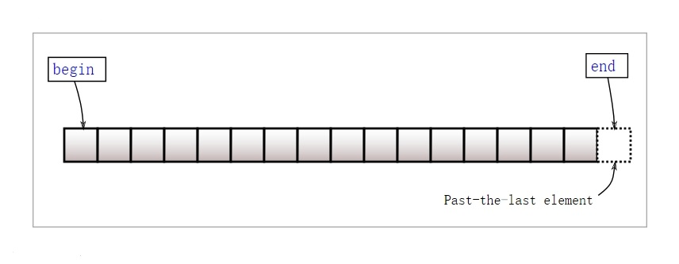
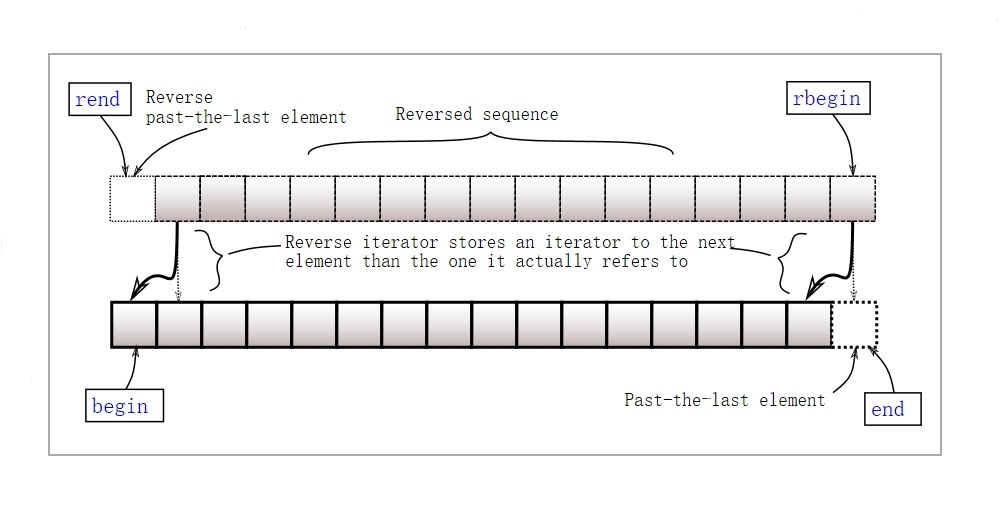

# STL(Standard Template Library)
标准模板库

## 模板
* C/C++是强类型语言
  * 类型是固定的
  * 定义变量时，要明确类型
  * 类型检查很严格
* 泛型编程
  * 将类型参数化
* 将类型参数化后，写出来的函数，称为函数模板。写出来的类，称为类模板。
* 函数模板和类模板可以实例化，得到具体的函数和类。
* 编写更加灵活通用的代码，提高代码复用，提高开发效率。

## 函数模板
* 函数模板定义
  ```c++
  template<typename T, ...>
  template<class T>
  template<typename T, typename U>
  ```
* `template`：是一个用于声明模板的标识符，‌而不是一个关键字。‌表明接下来的是一个函数模板或类模板。
* `typename`：是一个关键字，‌用于在模板编程中明确指出某个标识符是一个类型名，‌而不是一个变量或其他类型的标识符。‌可用`class`替换。
* `T`：泛型参数，代表某一类型。

### 函数模板实例化
在编译阶段，遇到函数模板时，用具体的类型将函数模板实例化成一个具体的函数。
* 显式指定类型
  * 隐式推导后有歧义
  * 无法隐式推导
    ```c++
    template<typename T>
    void fun() {
        T a;
    }
    ```
* 隐式推导类型：根据实参推导类型

### 函数模板二次编译
* 第一次编译：检查模板语法
* 第二次编译：模板实例化后，针对具体的类型再次编译

### 函数模板特殊化
针对某些类型，函数模板不再满足其要求，需要进行特殊处理。
* 重载函数模板：实现一个和函数模板同名的函数。会优先调用非模板函数。

### 函数模板非类型参数
* 允许函数模板类型参数可以有非类型参数
* 函数模板非类型参数必须显式实例化
* 函数模板非类型参数实例化必须用常量
  * `constexpr`：一定是常量
  * `const`：可能不是常量，取决于初始化

### 函数模板类型参数缺省值
* 遵循靠右原则
* 非类型参数也可以有缺省值


## 类模板
* 模板类型参数作用于成员变量
* 模板类型参数作用于成员函数
* 类模板必须显式实例化

### 类模板特化
* 全特化
  * 类模板中所有代码都重新写
* 成员特化
  * 只针对类模板中的个别函数特殊处理

* 局部特化
  * 针对特殊场景，进行特化处理
    * 通用版本是`T`类型，可以针对`T*`和`T[]`进行局部特化
    * 通用版本是`T`类型，可以针对`TKK`、`TTT`等情况进行局部特化
  * 在实例化时，会选择特化程度更高的类模板

### 类模板非类型参数和缺省模板类型
* 类模板非类型参数，在实例化时需要常量或常量表达式
* 模板缺省参数缺省类型遵循靠右原则

### 类模板分离编译
* 不支持`.h`和`.cpp`分离
  * 在实例化时需要用到类模板的代码，实例化出具体的类
    * 如果没有使用模板编，编译器在编译的时候无法确定模板的实例，所以编译器只能等到用户使用此模板的时候才能进行实例化，才能确定模板的具体类型，从而为其分配内存空间，生成符号。
  * 每个cpp文件单独编译
    * 如果单独编译模板的`.h`和`.cpp`文件，是不会生成对应函数符号
* 类模板和函数模板声明定义都是在`.h`中

### 类模板的应用
* 继承
* 派生

### 类模板作为模板类型参数
### 类模板作为成员
* 成员属性
* 成员函数
* 内部类型


## 六大组件
* 容器（`Container`）
* 算法（`Algorithm`）
* 迭代器（`Iterator`）
* 分配器（`Allocator`）
* 适配器（`Adapter`）
* 仿函数（`Functor`）

### 容器
* 数据结构
  * 以一定的方式来组织、存储、管理数据
* 线性容器
  * 向量（`vector`）
  * 双向链表（`list`）
  * 双端队列（`deque`）
  * 单向链表（`forward_list，C++11`）
  * 静态数组（`array，C++11`）
* 关联容器
  * 有序关联容器（红黑树）
    * 集合（`set`）
    * 多重集合（`multiset`）
    * 映射（`map`）
    * 多重映射（`multimap`）
  * 无序关联容器（哈希表）
    * 集合（`unordered_set`）
    * 多重集合（`unordered_multiset`）
    * 映射（`unordered_map`）
    * 多重映射（`unordered_multimap`）

### 有关set
* `set`‌：有序集合，元素唯一，不支持重复元素。使用红黑树实现，提供对数时间复杂度的搜索、插入和删除操作。元素按顺序排列，通常用于需要有序存储且元素不重复的场景‌。
* `multiset`：有序集合，但允许元素重复。使用红黑树实现，提供对数时间复杂度的操作，适用于需要有序存储且元素可以重复的场景‌。
* `unordered_set`：无序的集合，元素唯一。使用哈希表实现，提供平均常数时间复杂度的搜索、插入和删除操作。适用于不需要元素有序且元素不重复的场景‌。
* `unordered_multiset`：无序的集合，但允许元素重复。使用哈希表实现，提供平均常数时间复杂度的操作，适用于不需要元素有序且元素可以重复的场景‌。
* 主要区别：
  * 有序性：`set`和`multiset`是有序容器，`unordered_set`和`unordered_multiset`是无序容器。
  * 查找速度：`unordered_set`和`unordered_multiset`通过哈希表实现，查找速度快于`set`和`multiset`。
  * 元素唯一性：`set`和`unordered_set`的元素是唯一的，`multiset`和`unordered_multiset`的元素可以不唯一。
  * 元素插入和访问的复杂度：`unordered_set`和`unordered_multiset`插入和访问操作的性能更好。

### 有关map
* `map`：存储键值对的有序关联容器，每个键只能对应一个值。
* `multimap`：存储键值对的有序关联容器，每个键可以对应多个值。
* `unordered_map`：存储键值对的无序关联容器，通过哈希表实现，每个键只能对应一个值。
* `unordered_multimap`：存储键值对的无序关联容器，通过哈希表实现，每个键可以对应多个值。
* 主要区别：
  * 有序性：`map`和`multimap`是有序容器，而`unordered_map`和`unordered_multimap`是无序容器。
  * 查找速度：`unordered_map`和`unordered_multimap`通过哈希表实现，查找速度快于`map`和`multimap`。
  * 键唯一性：`map`和`unordered_map`的键是唯一的，`multimap`和`unordered_multimap`的键可以不唯一。
  * 元素插入和访问的复杂度：`unordered_map`和`unordered_multimap`插入和访问操作的性能更好。


### 算法
* 实现了对容器的基础操作
* 不直接作用于容器，而是通过迭代器
* 函数模板

### 迭代器
* 一种泛化的指针
* 容器与算法的粘合剂，使得算法不局限于某一种容器，更加通用
* 类模板





### 适配器
为了适配或达到某种要求，对容器、迭代器、函数的接口进行改造
* 容器适配器
  * `stack`
  * `queue`
  * `priority_queue`
* 迭代器适配器
* 函数适配器

### 分配器
* 分配、管理、释放容器的内部空间
* C++中`new/new[]`分配内存的同时，伴随着构造函数
* 提供了原始的内存申请、回收、填充功能

### 仿函数
* 重载了`operator()`运算符的对象、函数指针、`lambda`表达式
* 制定算法的策略

## 智能指针
* `smart_ptr`
* `unique_ptr`
* `shared_ptr`
* `weak_ptr`

| method                     | vector | list | deque | forward_list |
|----------------------------|--------|------|-------|--------------|
| `at`                       | Y      | N    | Y     | N            |
| `[]`                       | Y      | N    | Y     | N            |
| `back`                     | Y      | Y    | Y     | N            |
| `front`                    | Y      | Y    | Y     | Y            |
| `push_front/emplace_front` | N      | Y    | Y     | Y            |
| `pop_front`                | N      | Y    | Y     | Y            |
| `push_back/emplate_back`   | Y      | Y    | Y     | N            |
| `pop_back`                 | Y      | Y    | Y     | N            |
| `size`                     | Y      | Y    | Y     | N            |
| `resize`                   | Y      | Y    | Y     | Y            |


